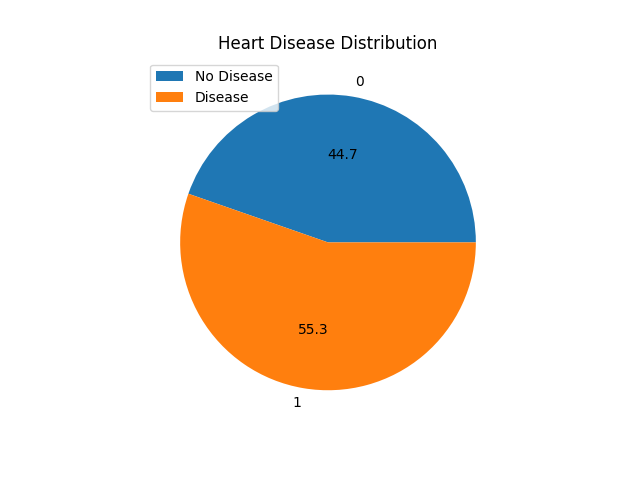
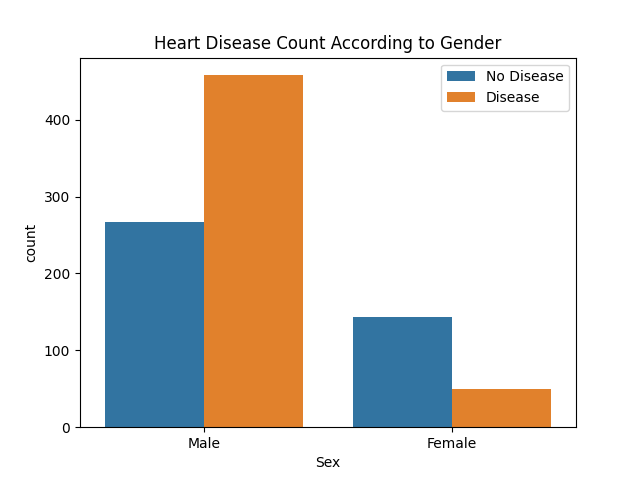
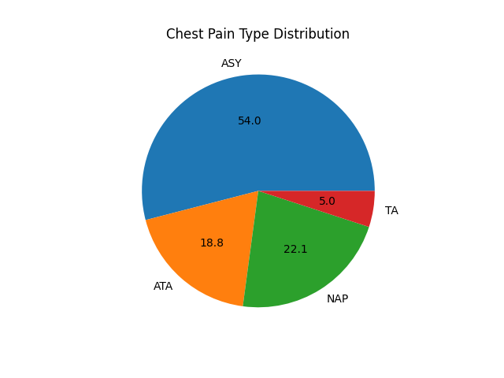
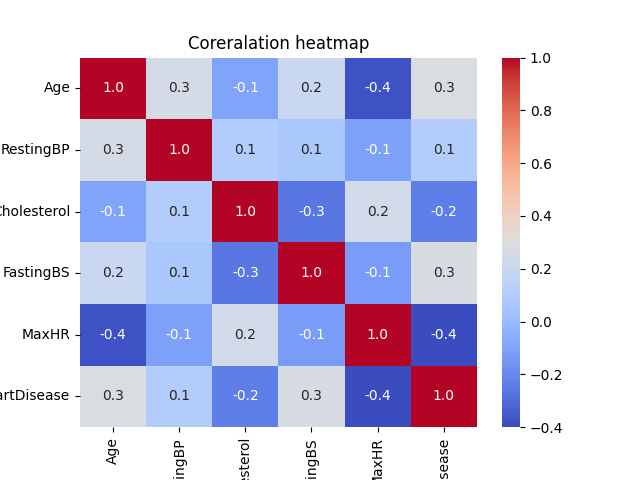

# HeartDisease_EDA
# 🫀 Heart Disease Dataset – Exploratory Data Analysis (EDA)

## 📊 Overview

This project performs an Exploratory Data Analysis (EDA) on the Heart Disease dataset to understand the relationships between medical attributes and the presence of heart disease. It uses Python with libraries such as Pandas, Seaborn, and Matplotlib to clean, analyze, and visualize data.

---

## 📁 Dataset

- **Source:** [UCI Machine Learning Repository](https://archive.ics.uci.edu/ml/datasets/heart+Disease)
- **Features Include:**
  - Age, Sex, Chest Pain Type, Resting Blood Pressure, Cholesterol, Fasting Blood Sugar
  - Resting ECG results, Max Heart Rate Achieved, Exercise-Induced Angina
  - ST Depression, Slope of ST segment, Number of Major Vessels, Thalassemia
  - **Target:** Heart Disease (1 = presence, 0 = absence)

---

## 🛠️ Tools & Libraries

- Python
- Pandas
- Matplotlib
- Seaborn
- Jupyter Notebook / Google Colab

---

## 📉 Visualizations

All plots are saved in the `images/` folder. Below are key visuals:

| Visualization | Description |
|---------------|-------------|
|  | Distribution of heart disease cases |
|  | Relationship between heart disease and gender |
|  | Distribution of Chest Pain Types |
|  | Correlation matrix of features |

---

## 🔍 Key Insights
- The **age group 55–60** shows the highest risk, and stress-related features like ST_Slope and Oldpeak show patterns related to the disease.
- **55.3%** of people in the dataset have heart disease.
- **Chest Pain Type** shows a clear relationship with heart disease — especially asymptomatic cases.
- **The ASY (Asymptomatic)** chest pain type is highly associated with heart disease.
- **Higher age** correlates with a greater risk of heart disease.
- **Male** patients are more prone to heart disease in this dataset.
- **ST depression**, **max heart rate**, and **exercise-induced angina** are strong indicators.
- Some features are moderately correlated, suggesting potential multicollinearity.

---

## 📌 Conclusion

The analysis helps identify important clinical indicators that may predict heart disease. These insights can be valuable for healthcare professionals or for building predictive machine learning models in the future.

---

## 🚀 Future Work

- Train classification models (Logistic Regression, Decision Trees, etc.)
- Perform feature selection and hyperparameter tuning
- Build a Streamlit or Flask web app for deployment

---

## 🙋‍♂️ Author

**Jaiveer Singh Sahni**  
📬 [GitHub Profile](https://github.com/JaiveerSahni)

---

